

<h1>

Hilorama
</h1>

  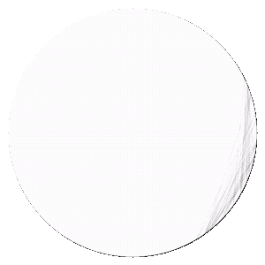

  <strong>Girl with a Pearl Earring — Johannes Vermeer</strong>

  
  
  
  
  

Hilorama is a high-performance String Art generator for Android, combining a native C++ engine with a modern Jetpack Compose interface to transform images into artistic string-based compositions and export them as images or videos.

## Table of Contents

- [Themes and design](#themes-and-design)
- [Drawing](#drawing)
- [Features](#features)
- [Step by step](#step-by-step)
- [Bookmark](#bookmark)
- [Performance](#performance)
- [The end](#the-end)

## Themes and design

From the UI design there is not much to say: the app has light and dark themes according to your preference.

  <table>
    <tr>
      <td align="center">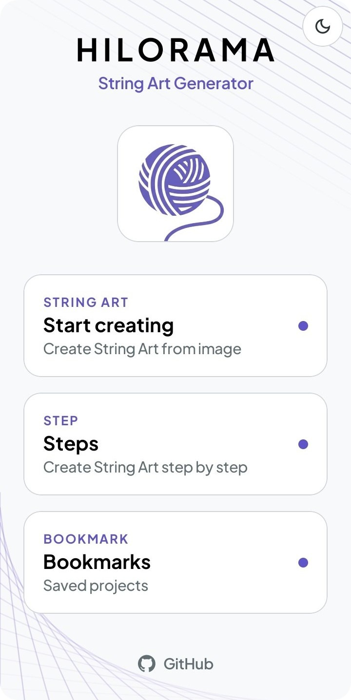 <strong>Light</strong></td>
      <td align="center">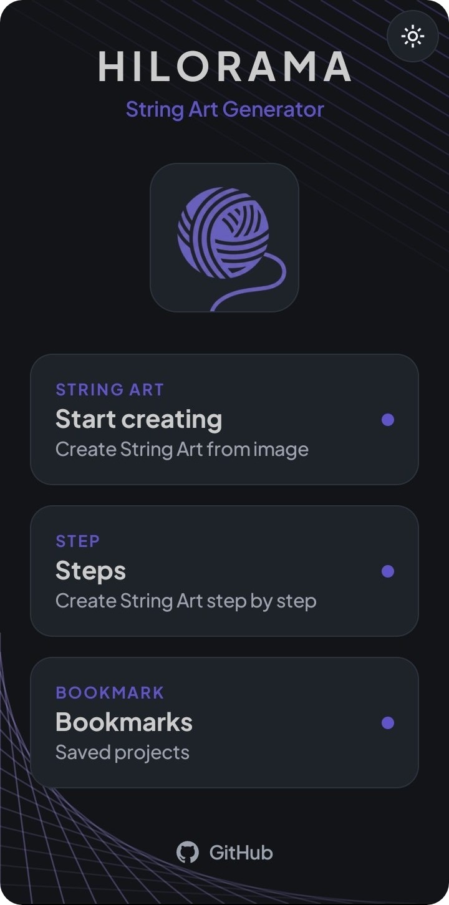 <strong>Dark</strong></td>
    </tr>
  </table>

If you are worried about those beautiful purple lines disappearing, don't be. It is just an animation, and it will come back :p

## Drawing

### Coloring

Unlike most String Art apps that generate monochrome compositions, Hilorama can produce colored string-art output in four different modes. Each mode changes the way the drawing interprets the source image and the type of visual mood it creates.

  <table>
    <tr>
      <td>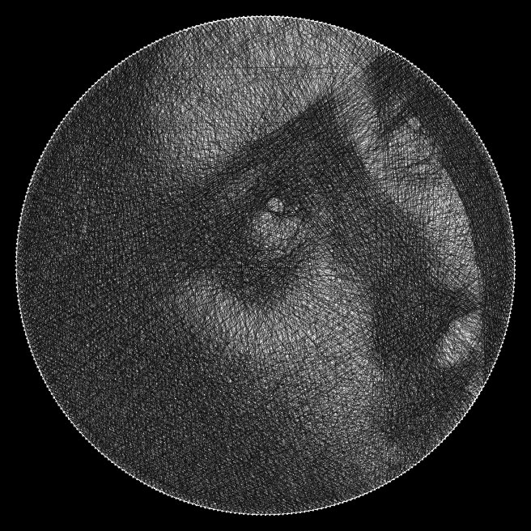</td>
      <td><strong>Gray</strong> Uses black and white only. The best choice for a black-and-white style and excellent for preserving fine details.</td>
    </tr>
    <tr>
      <td>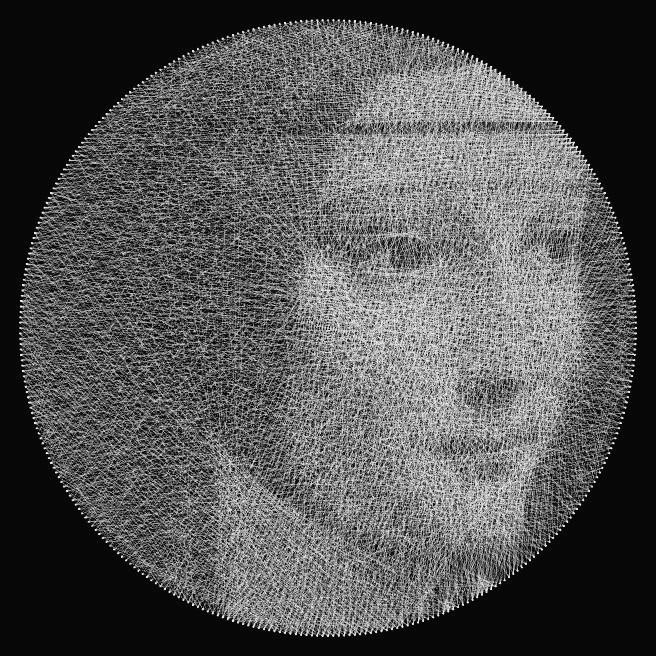</td>
      <td><strong>Mono</strong> Uses white and black in the inverse configuration. It produces an image with strong brightness and works very well for images with light backgrounds.</td>
    </tr>
    <tr>
      <td>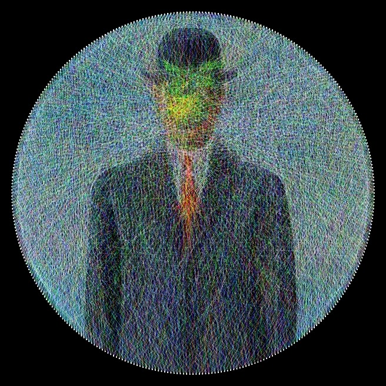</td>
      <td><strong>RGB</strong> Uses Red, Green, and Blue channels, which combine to produce the full range of tones. Like Gray, it produces images with high brightness, and the recommended use case is essentially the same.</td>
    </tr>
    <tr>
      <td>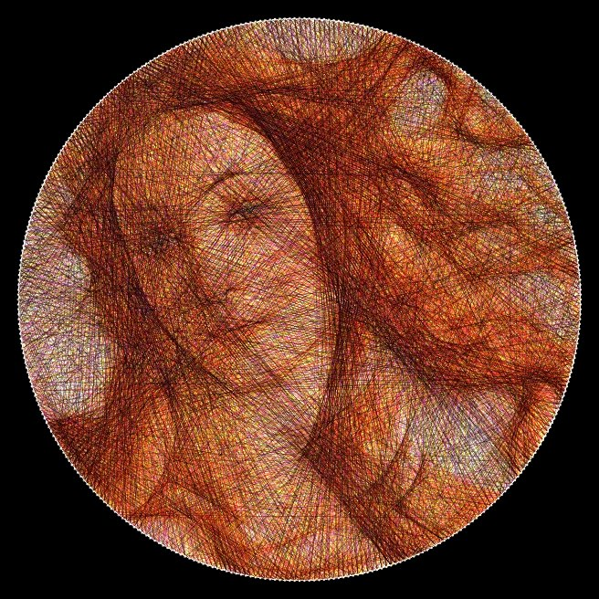</td>
      <td><strong>CMY</strong> Uses Cyan, Magenta, and Yellow channels. This is the subtractive RGB mode, and it is often the mode you will want to use most of the time because it produces very good results in many cases.</td>
    </tr>
  </table>

These modes allow the user to choose the visual language of the generated work, from the minimalism of monochrome to the richness of additive or subtractive color systems.

Not every image produces equally good results in every mode, so it is worth trying different color settings to find the combination that fits each composition best.

### Parameters

Parameters are the main controls that shape the final composition in Hilorama. They determine how dense the drawing becomes and how much work the engine needs to perform to produce the final String Art result.

#### Threads

The number of threads directly affects the amount of detail and the complexity of the generated drawing. More threads usually create a richer approximation, but the computational cost also increases.

  <table>
    <tr>
      <td align="center">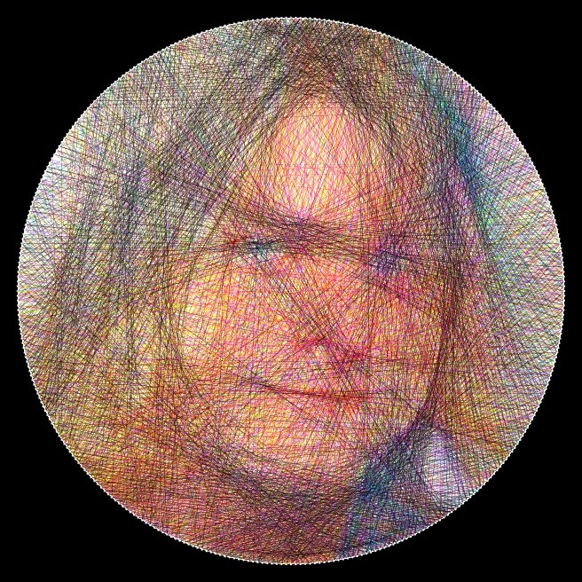 <strong>3000 threads</strong></td>
      <td align="center">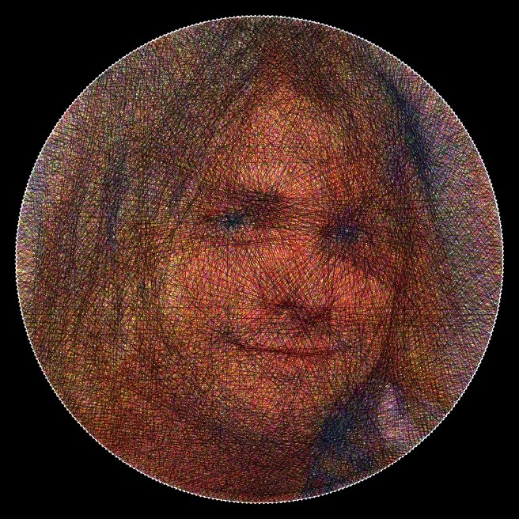 <strong>6000 threads</strong></td>
      <td align="center">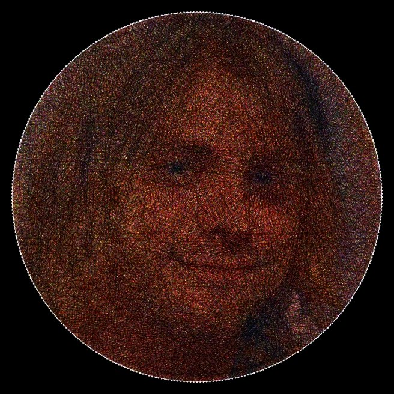 <strong>9000 threads</strong></td>
    </tr>
  </table>

As you can see here, the right choice is 6000 threads. However, you may choose up to 12000, but in most cases this quantity will be too much. Of course, it depends on the image.

#### Nails

Unlike threads, the maximum number of nails will produce a more detailed image, but like threads, more nails increase significantly the time complexity. However, the recommended approach is to leave the nails at 360 and vary the threads parameter instead. Here you can see an example with a picture of the great Robe Iniesta ❤

  <table>
    <tr>
      <td align="center">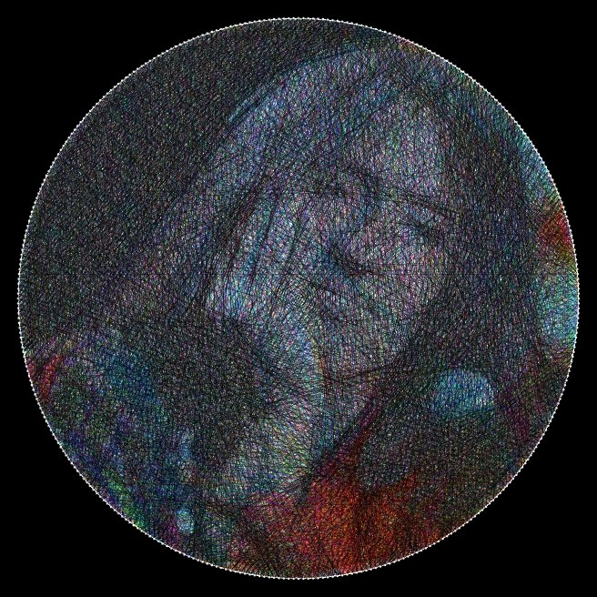 <strong>360 nails</strong></td>
      <td align="center">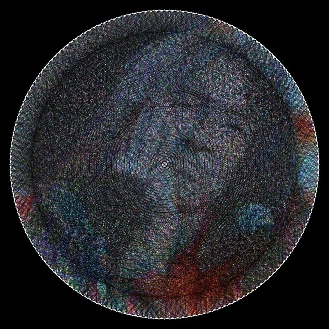 <strong>180 nails</strong></td>
      <td align="center">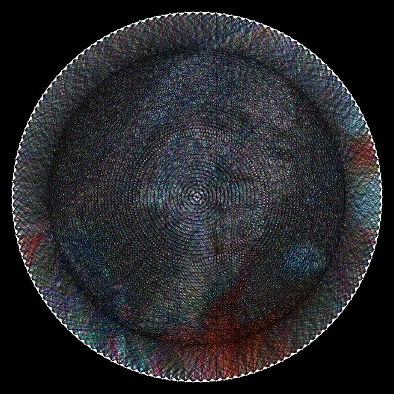 <strong>150 nails</strong></td>
    </tr>
  </table>

## Features

### AI Image

The app can generate a source image through a request to Pollinations AI using a prompt defined by the user. Once the image is ready, it is passed into the app's string-art generation pipeline, where the algorithm transforms it into a customized Hilorama composition.

  <table>
    <tr>
      <td align="center">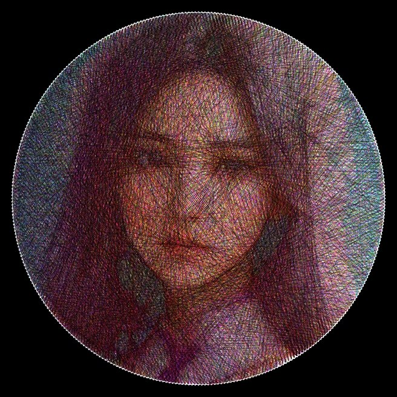 <strong>AI example 1</strong></td>
      <td align="center">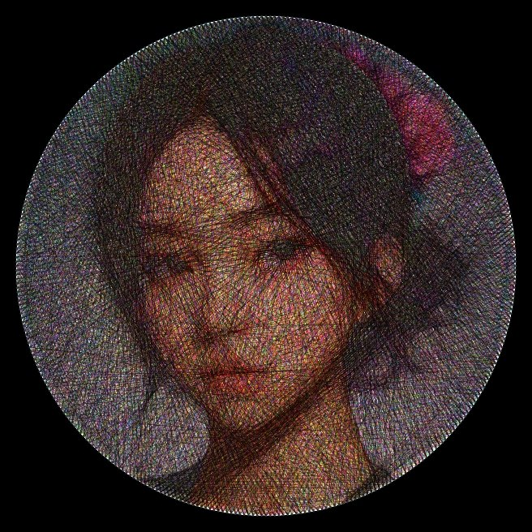 <strong>AI example 2</strong></td>
    </tr>
  </table>

> Warning: this is a free AI model, so it can make mistakes. The best results usually come from simple, generic prompts that the model can interpret easily without strain.

### Save as image and video

The app gives you two ways to preserve the final result: export a still image or record the live generation as a video.

- Image

  The app captures the current state of the generated composition and saves it as a bitmap to the device gallery using Android media storage APIs. This means the image can be taken from the current live or paused state of the Hilorama, not only from a fixed final frame. The file is stored in the Pictures folder, making it easy to access and share the artwork later.

- Video

  The app records the same real-time rendering shown to the user and exports it as an MP4 file. The result is saved in a dedicated Hilorama folder, using MediaCodec and MediaMuxer to preserve the same visual process as the live preview.

### Fade

The app includes a fade window that lets the user slide a vertical mask to reveal part of the original image while the Hilorama generation continues underneath. This creates a direct, one-to-one comparison between the algorithmic output and the original reference, making it easy to evaluate how faithfully the composition follows the source.

  <table>
    <tr>
      <td align="center">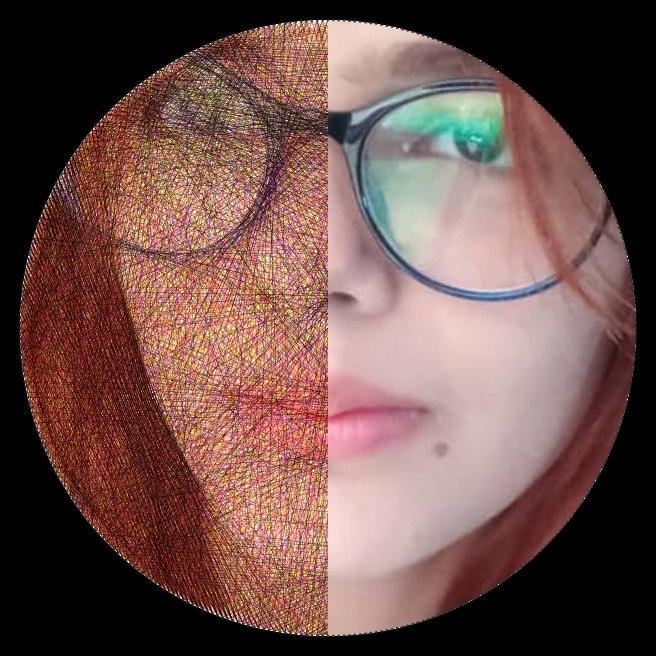 <strong>Lady 1</strong></td>
      <td align="center">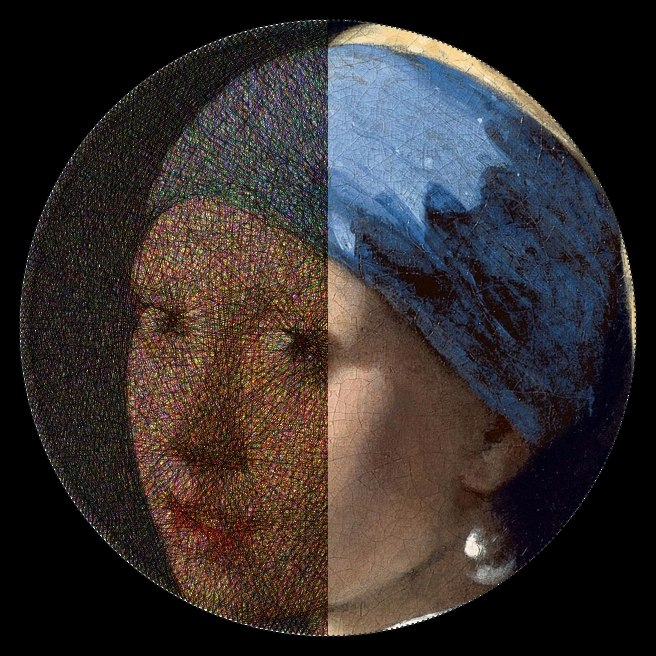 <strong>Lady 2</strong></td>
    </tr>
  </table>

Here is an example of the feature with images of two beautiful young women from different time ;)

## Step by step

This mode helps you understand how the drawing is constructed step by step, making the process easier to follow and more intuitive to learn.

  <table>
    <tr>
      <td align="center">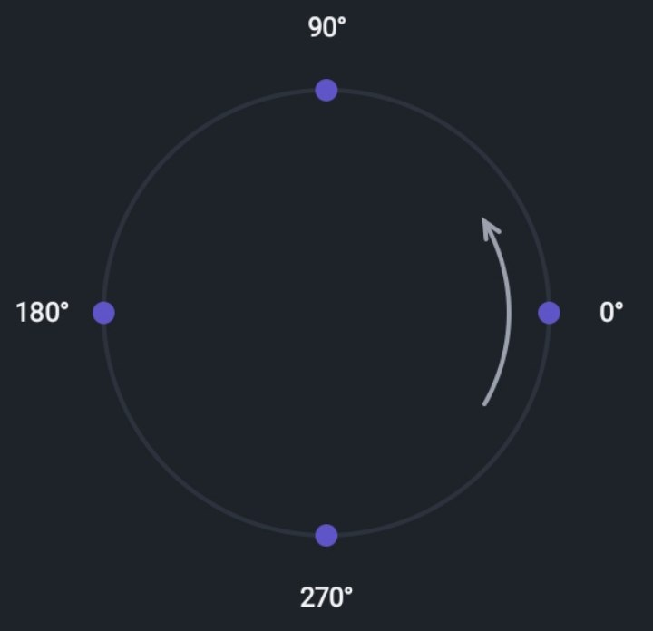</td>
      <td valign="middle" style="padding-left: 18px; text-align: left;">
        Each nail is numbered around the circle in order, starting from 0 and continuing clockwise. The numbers are the nail indices, and every thread is defined by the connection between two of these indices.
          
      </td>
    </tr>
  </table>

Easy to understand, right? Well, if you ever get lost, you can consult the instructions by pressing the third button in the top bar.

  <table>
    <tr>
      <td align="center">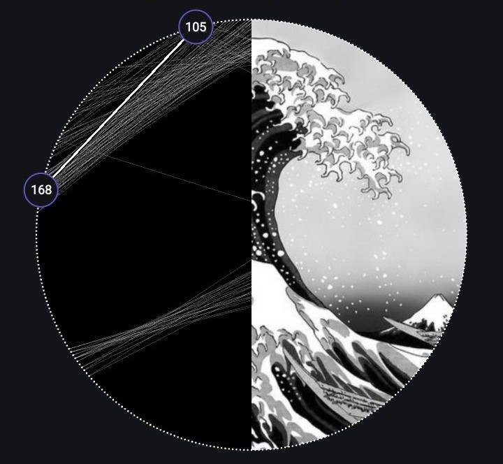</td>
      <td align="center">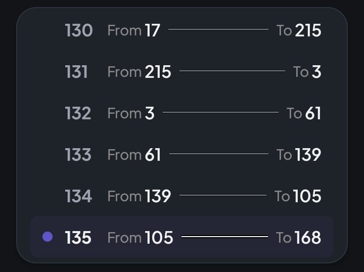</td>
    </tr>
  </table>

The two circles with their corresponding numbers represent the two nails that hold the thread to be drawn. Each number identifies a nail index, and the thread is the connection between those two nails. On the right-side list, you can review the sequence more clearly and even go back to any previous thread whenever needed.

But what if you need to close the app in the middle of a step-by-step Hilorama creation? This app offers a solution for that problem. See it in the next section.

## Bookmark

In the step-by-step menu, using the second button in the top bar, the bookmark icon, the current work is saved even if the app is closed. This makes it easy to pause the process without losing the progress already made.

  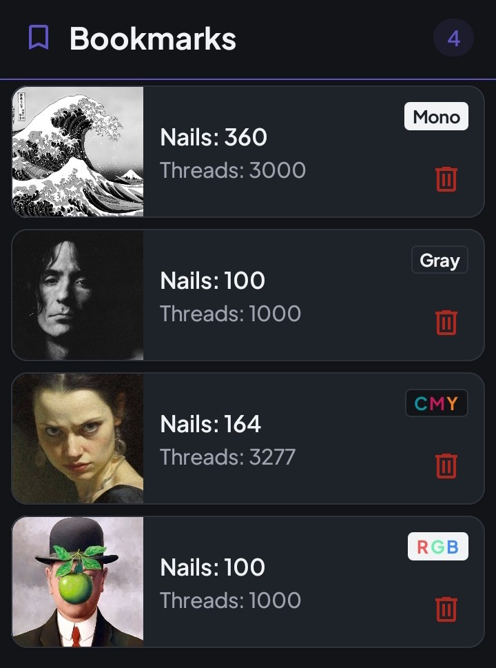

From this menu, you can load each saved work and continue exactly from the point where you left it. The app keeps the progress of the current Hilorama so you can resume the process naturally and continue drawing from the same thread sequence.

## Performance

String Art is, at its heart, an approximation problem: a set of lines is used to recreate a continuous image with a finite number of segments.

### From equation to approximation

The problem can be modeled as a linear system:

$$
A x = b
$$

Here, the matrix $A$ represents the geometric relationships between anchors and candidate segments, the vector $x$ encodes the decision of which threads should be active, and $b$ represents the target image or the desired approximation.

In practice, solving this exactly is not feasible for a realistic composition: the number of possible combinations grows explosively, and the exact solution becomes computationally intractable.

### Why greedy is the key

Instead of solving the full problem at once, the algorithm chooses the next segment that yields the largest improvement. With $n$ anchors there are

$$
\frac{n(n-1)}{2}
$$

possible threads to consider.

The goal is then to choose the thread that minimizes the residual error:

$$
\min \|A x - b\|
$$

This greedy strategy trades perfect optimization for a fast, iterative approximation that is good enough to produce compelling artistic results.

### Bresenham algorithm

Before the greedy decision is applied, the app needs a reliable way to draw a line between two discrete points. That is where the Bresenham algorithm becomes essential.

Bresenham is an integer-only line rasterization method used to determine which pixels should be activated when drawing a straight segment on a grid. In Hilorama, this is critical because the final String Art composition is built from many small geometric segments, and each one must be mapped accurately onto the image lattice.

  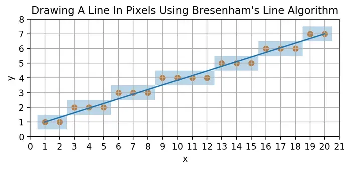

The result is a fast, precise, and memory-efficient rendering step that enables the greedy optimization to operate over real image data without wasting computational effort on expensive floating-point rasterization.

### Why C++?

The expensive part of Hilorama is not the UI; it is the repeated math behind each approximation step. We evaluate many candidate segments, update the residual error, and redraw the image thousands of times as the composition improves.

That is where C++ helps: it keeps the hot loops leaner and gives tighter control over memory and CPU usage. Kotlin remains the right tool for the Android interface, but the heavy numerical work is delegated to the native engine.

## The end

      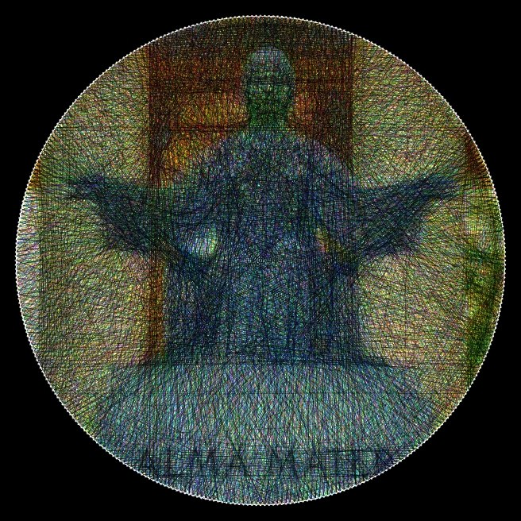
      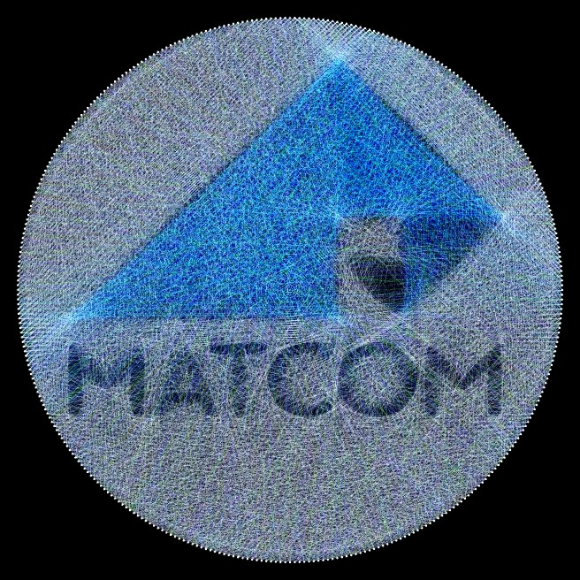

  Made with love by a University of Havana student, thank you for stopping by and leave a star if you like the project! ⭐

